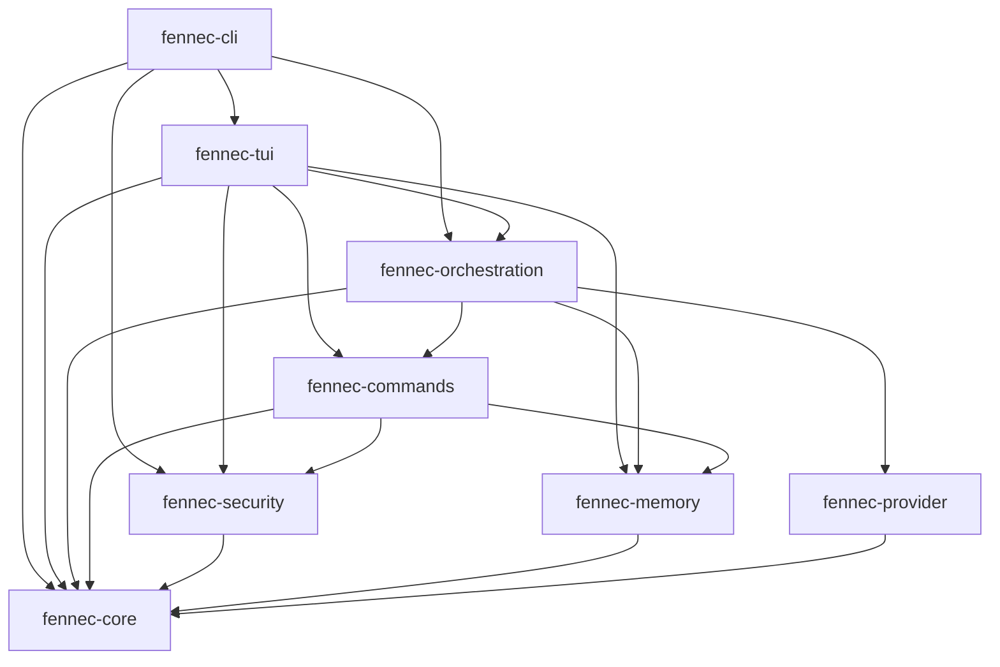

# Fennec Developer Guide

A comprehensive guide for developers looking to extend, modify, or contribute to Fennec AI Assistant.

## Table of Contents

1. [Development Environment Setup](#development-environment-setup)
2. [Architecture Overview](#architecture-overview)
3. [Extending Fennec](#extending-fennec)
4. [Testing Strategy](#testing-strategy)
5. [Contributing Guidelines](#contributing-guidelines)
6. [Debugging and Troubleshooting](#debugging-and-troubleshooting)
7. [Performance Optimization](#performance-optimization)
8. [Security Considerations](#security-considerations)

## Development Environment Setup

### Prerequisites

- **Rust 1.70+** with 2021 edition support
- **Git** for version control
- **OpenAI API key** for testing LLM integration
- **IDE/Editor** with Rust support (VS Code + rust-analyzer recommended)

### Initial Setup

```bash
# Clone the repository
git clone https://github.com/fennec-ai/fennec.git
cd fennec

# Install Rust dependencies
cargo build

# Set up development environment
cp .env.example .env
# Edit .env with your OpenAI API key

# Run tests to verify setup
cargo test

# Run development version
cargo run --bin fennec -- --verbose
```

### Development Tools

```bash
# Install additional development tools
cargo install cargo-watch      # Auto-rebuild on changes
cargo install cargo-audit      # Security vulnerability scanning
cargo install cargo-expand     # Macro expansion debugging
cargo install flamegraph       # Performance profiling

# Run with hot reloading
cargo watch -x 'run --bin fennec'

# Check for security vulnerabilities
cargo audit

# Run lints and formatting
cargo clippy --all-targets --all-features
cargo fmt --all
```

### Project Structure

```
fennec/
├── crates/
│   ├── fennec-cli/         # Main CLI binary
│   ├── fennec-core/        # Shared types and traits
│   ├── fennec-tui/         # Terminal user interface
│   ├── fennec-orchestration/ # Session management
│   ├── fennec-memory/      # Memory and context system
│   ├── fennec-provider/    # LLM provider integrations
│   ├── fennec-security/    # Security and audit system
│   └── fennec-commands/    # Command implementations
├── docs/                   # Documentation
├── examples/               # Usage examples
├── config/                 # Configuration templates
├── tests/                  # Integration tests
└── scripts/                # Build and utility scripts
```

## Architecture Overview

### Crate Dependencies



### Key Design Patterns

#### 1. Async-First Architecture

All I/O operations use async Rust patterns:

```rust
// Good: Async function with proper error handling
pub async fn load_session(&self, id: &SessionId) -> Result<Option<Session>> {
    let path = self.session_path(id);
    if !path.exists() {
        return Ok(None);
    }

    let content = tokio::fs::read_to_string(&path).await?;
    let session: Session = serde_json::from_str(&content)?;
    Ok(Some(session))
}

// Avoid: Blocking operations in async context
pub async fn bad_load_session(&self, id: &SessionId) -> Result<Option<Session>> {
    // DON'T: This blocks the async runtime
    let content = std::fs::read_to_string(self.session_path(id))?;
    Ok(Some(serde_json::from_str(&content)?))
}
```

#### 2. Trait-Based Abstractions

Use traits for extensibility:

```rust
#[async_trait]
pub trait ProviderClient: Send + Sync {
    async fn stream_completion(
        &self,
        request: CompletionRequest,
    ) -> Result<Pin<Box<dyn Stream<Item = Result<CompletionChunk>>>>>;

    fn provider_name(&self) -> &str;
}

// Implementation is hidden behind trait
pub struct ProviderRegistry {
    providers: HashMap<String, Box<dyn ProviderClient>>,
}

impl ProviderRegistry {
    pub fn register(&mut self, name: String, provider: Box<dyn ProviderClient>) {
        self.providers.insert(name, provider);
    }
}
```

#### 3. Error Handling Strategy

Use structured error types with `thiserror`:

```rust
#[derive(thiserror::Error, Debug)]
pub enum FennecError {
    #[error("Configuration error: {0}")]
    Config(String),

    #[error("Command execution failed: {0}")]
    Command(String),

    #[error("Provider error: {0}")]
    Provider(String),

    #[error("I/O error: {0}")]
    Io(#[from] std::io::Error),

    #[error("Serialization error: {0}")]
    Serialization(#[from] serde_json::Error),
}

// Usage with context
fn load_config(path: &Path) -> Result<Config> {
    let content = std::fs::read_to_string(path)
        .map_err(|e| FennecError::Config(format!("Failed to read config file: {}", e)))?;

    let config: Config = toml::from_str(&content)
        .map_err(|e| FennecError::Config(format!("Invalid config format: {}", e)))?;

    Ok(config)
}
```

## Extending Fennec

### Creating Custom Commands

#### 1. Basic Command Structure

```rust
// my-custom-command/src/lib.rs
use fennec_commands::{CommandExecutor, CommandDescriptor, CommandContext, CommandExecutionResult};
use fennec_core::{Result, command::Capability};
use async_trait::async_trait;
use serde::{Deserialize, Serialize};

#[derive(Debug, Clone, Serialize, Deserialize)]
pub struct AnalyzeArgs {
    pub file_path: String,
    pub analysis_type: AnalysisType,
    pub depth: Option<u32>,
}

#[derive(Debug, Clone, Serialize, Deserialize)]
pub enum AnalysisType {
    Security,
    Performance,
    CodeQuality,
}

pub struct AnalyzeCommand {
    // Command state if needed
}

impl AnalyzeCommand {
    pub fn new() -> Self {
        Self {}
    }
}

#[async_trait]
impl CommandExecutor for AnalyzeCommand {
    async fn execute(
        &self,
        args: &serde_json::Value,
        context: &CommandContext,
    ) -> Result<CommandExecutionResult> {
        // Parse arguments
        let analyze_args: AnalyzeArgs = serde_json::from_value(args.clone())?;

        // Validate file access
        let file_path = Path::new(&analyze_args.file_path);
        if !file_path.exists() {
            return Ok(CommandExecutionResult {
                success: false,
                output: String::new(),
                error: Some(format!("File not found: {}", analyze_args.file_path)),
                preview: None,
                metadata: Default::default(),
            });
        }

        // Perform analysis
        let analysis_result = self.perform_analysis(&analyze_args, context).await?;

        // Return result
        Ok(CommandExecutionResult {
            success: true,
            output: analysis_result.to_string(),
            error: None,
            preview: Some(analysis_result.into()),
            metadata: Default::default(),
        })
    }

    fn descriptor(&self) -> CommandDescriptor {
        CommandDescriptor {
            name: "analyze".to_string(),
            description: "Perform code analysis with various strategies".to_string(),
            capabilities: vec![Capability::ReadFile, Capability::ProviderAccess],
            requires_approval: false,
            preview_mode: PreviewMode::Always,
        }
    }
}

impl AnalyzeCommand {
    async fn perform_analysis(
        &self,
        args: &AnalyzeArgs,
        context: &CommandContext,
    ) -> Result<AnalysisResult> {
        // Read file content
        let content = tokio::fs::read_to_string(&args.file_path).await?;

        // Perform analysis based on type
        match args.analysis_type {
            AnalysisType::Security => self.security_analysis(&content, args.depth).await,
            AnalysisType::Performance => self.performance_analysis(&content, args.depth).await,
            AnalysisType::CodeQuality => self.quality_analysis(&content, args.depth).await,
        }
    }

    async fn security_analysis(&self, content: &str, depth: Option<u32>) -> Result<AnalysisResult> {
        // Implement security analysis logic
        let findings = vec![
            "No hardcoded secrets found".to_string(),
            "Input validation appears adequate".to_string(),
        ];

        Ok(AnalysisResult {
            analysis_type: AnalysisType::Security,
            findings,
            score: 85,
            recommendations: vec!["Consider adding rate limiting".to_string()],
        })
    }
}

#[derive(Debug, Clone, Serialize, Deserialize)]
pub struct AnalysisResult {
    pub analysis_type: AnalysisType,
    pub findings: Vec<String>,
    pub score: u32,
    pub recommendations: Vec<String>,
}
```

#### 2. Registering Custom Commands

```rust
// In your main application or plugin
use fennec_commands::CommandRegistry;

pub fn register_custom_commands(registry: &mut CommandRegistry) -> Result<()> {
    // Register the analyze command
    registry.register(Box::new(AnalyzeCommand::new()))?;

    // Register other custom commands
    registry.register(Box::new(FormatCommand::new()))?;
    registry.register(Box::new(RefactorCommand::new()))?;

    Ok(())
}

// Integration in main application
#[tokio::main]
async fn main() -> Result<()> {
    let mut registry = CommandRegistry::new();

    // Register built-in commands
    fennec_commands::initialize_builtin_commands(&mut registry).await?;

    // Register custom commands
    register_custom_commands(&mut registry)?;

    // Continue with application setup...
    Ok(())
}
```

### Creating Custom Providers

#### 1. Implementing Provider Trait

```rust
// custom-provider/src/lib.rs
use fennec_provider::{ProviderClient, CompletionRequest, CompletionChunk, ModelInfo};
use async_trait::async_trait;
use futures::Stream;
use std::pin::Pin;

pub struct AnthropicProvider {
    client: reqwest::Client,
    config: AnthropicConfig,
}

impl AnthropicProvider {
    pub fn new(config: AnthropicConfig) -> Result<Self> {
        let client = reqwest::Client::builder()
            .timeout(Duration::from_secs(config.timeout))
            .build()?;

        Ok(Self { client, config })
    }

    async fn parse_streaming_response(
        &self,
        mut response: reqwest::Response,
    ) -> Result<Pin<Box<dyn Stream<Item = Result<CompletionChunk>>>>> {
        use futures::stream::StreamExt;

        let stream = response
            .bytes_stream()
            .map(|chunk| self.parse_chunk(chunk))
            .filter_map(|result| async move {
                match result {
                    Ok(Some(chunk)) => Some(Ok(chunk)),
                    Ok(None) => None, // Skip empty chunks
                    Err(e) => Some(Err(e)),
                }
            });

        Ok(Box::pin(stream))
    }

    fn parse_chunk(&self, chunk: Result<bytes::Bytes, reqwest::Error>) -> Result<Option<CompletionChunk>> {
        let chunk = chunk.map_err(|e| FennecError::Provider(e.to_string()))?;

        // Parse Server-Sent Events format
        let chunk_str = std::str::from_utf8(&chunk)
            .map_err(|e| FennecError::Provider(format!("Invalid UTF-8: {}", e)))?;

        if chunk_str.starts_with("data: ") {
            let json_str = &chunk_str[6..]; // Skip "data: "
            if json_str.trim() == "[DONE]" {
                return Ok(None);
            }

            let chunk_data: AnthropicStreamChunk = serde_json::from_str(json_str)
                .map_err(|e| FennecError::Provider(format!("JSON parse error: {}", e)))?;

            Ok(Some(CompletionChunk {
                content: chunk_data.completion,
                finish_reason: chunk_data.stop_reason.map(|r| match r.as_str() {
                    "stop_sequence" => FinishReason::Stop,
                    "max_tokens" => FinishReason::Length,
                    _ => FinishReason::Stop,
                }),
                usage: None, // Anthropic provides usage in final chunk
            }))
        } else {
            Ok(None) // Skip non-data lines
        }
    }
}

#[async_trait]
impl ProviderClient for AnthropicProvider {
    async fn stream_completion(
        &self,
        request: CompletionRequest,
    ) -> Result<Pin<Box<dyn Stream<Item = Result<CompletionChunk>>>>> {
        let url = format!("{}/v1/complete", self.config.base_url);

        // Convert request to Anthropic format
        let anthropic_request = AnthropicRequest {
            prompt: self.build_prompt(&request.messages),
            model: request.model,
            max_tokens_to_sample: request.max_tokens.unwrap_or(4096),
            temperature: request.temperature,
            stream: true,
        };

        let response = self.client
            .post(&url)
            .header("x-api-key", &self.config.api_key)
            .header("anthropic-version", "2023-06-01")
            .header("content-type", "application/json")
            .json(&anthropic_request)
            .send()
            .await
            .map_err(|e| FennecError::Provider(format!("Request failed: {}", e)))?;

        if !response.status().is_success() {
            return Err(FennecError::Provider(
                format!("API request failed: {}", response.status())
            ));
        }

        self.parse_streaming_response(response).await
    }

    async fn get_models(&self) -> Result<Vec<ModelInfo>> {
        // Anthropic doesn't have a models endpoint, return known models
        Ok(vec![
            ModelInfo {
                id: "claude-3-opus-20240229".to_string(),
                name: "Claude 3 Opus".to_string(),
                context_length: 200000,
            },
            ModelInfo {
                id: "claude-3-sonnet-20240229".to_string(),
                name: "Claude 3 Sonnet".to_string(),
                context_length: 200000,
            },
        ])
    }

    fn provider_name(&self) -> &str {
        "anthropic"
    }
}

#[derive(Debug, Clone, Serialize, Deserialize)]
struct AnthropicRequest {
    prompt: String,
    model: String,
    max_tokens_to_sample: u32,
    temperature: Option<f32>,
    stream: bool,
}

#[derive(Debug, Clone, Serialize, Deserialize)]
struct AnthropicStreamChunk {
    completion: Option<String>,
    stop_reason: Option<String>,
}

#[derive(Debug, Clone)]
pub struct AnthropicConfig {
    pub api_key: String,
    pub base_url: String,
    pub timeout: u64,
}

impl AnthropicProvider {
    fn build_prompt(&self, messages: &[ChatMessage]) -> String {
        let mut prompt = String::new();

        for message in messages {
            match message.role.as_str() {
                "user" => prompt.push_str(&format!("\\n\\nHuman: {}", message.content)),
                "assistant" => prompt.push_str(&format!("\\n\\nAssistant: {}", message.content)),
                "system" => {
                    // Anthropic handles system messages at the beginning
                    prompt = format!("{} {}", message.content, prompt);
                }
                _ => {} // Skip unknown roles
            }
        }

        prompt.push_str("\\n\\nAssistant:");
        prompt
    }
}
```

#### 2. Provider Registration

```rust
// Integration with Fennec
use fennec_provider::ProviderRegistry;

pub fn register_anthropic_provider(
    registry: &mut ProviderRegistry,
    config: AnthropicConfig,
) -> Result<()> {
    let provider = AnthropicProvider::new(config)?;
    registry.register("anthropic", Box::new(provider))?;
    Ok(())
}
```

### Creating Memory Adapters

```rust
// custom-memory-adapter/src/lib.rs
use fennec_memory::{MemoryAdapter, MemoryEntry, MemorySource};
use async_trait::async_trait;

pub struct NotionMemoryAdapter {
    notion_client: NotionClient,
    database_id: String,
}

impl NotionMemoryAdapter {
    pub fn new(api_key: String, database_id: String) -> Self {
        let notion_client = NotionClient::new(api_key);
        Self {
            notion_client,
            database_id,
        }
    }
}

#[async_trait]
impl MemoryAdapter for NotionMemoryAdapter {
    async fn load_entries(&self) -> Result<Vec<MemoryEntry>> {
        let pages = self.notion_client
            .query_database(&self.database_id)
            .await?;

        let mut entries = Vec::new();

        for page in pages {
            let entry = MemoryEntry {
                source: MemorySource::Custom("notion".to_string()),
                content: self.extract_page_content(&page)?,
                relevance_score: 1.0, // Base score, will be adjusted by search
                timestamp: page.last_edited_time,
                metadata: MemoryMetadata {
                    source_id: Some(page.id),
                    tags: page.properties.tags.unwrap_or_default(),
                    ..Default::default()
                },
            };

            entries.push(entry);
        }

        Ok(entries)
    }

    async fn store_entry(&self, entry: &MemoryEntry) -> Result<()> {
        let page_content = self.format_entry_for_notion(entry)?;

        self.notion_client
            .create_page(&self.database_id, page_content)
            .await?;

        Ok(())
    }

    async fn search_entries(&self, query: &str, max_results: usize) -> Result<Vec<MemoryEntry>> {
        let search_results = self.notion_client
            .search_database(&self.database_id, query)
            .await?;

        let mut entries = Vec::new();

        for result in search_results.into_iter().take(max_results) {
            let entry = MemoryEntry {
                source: MemorySource::Custom("notion".to_string()),
                content: self.extract_page_content(&result)?,
                relevance_score: result.relevance_score.unwrap_or(0.5),
                timestamp: result.last_edited_time,
                metadata: MemoryMetadata {
                    source_id: Some(result.id),
                    tags: result.properties.tags.unwrap_or_default(),
                    ..Default::default()
                },
            };

            entries.push(entry);
        }

        Ok(entries)
    }

    fn adapter_name(&self) -> &str {
        "notion"
    }
}
```

## Testing Strategy

### Unit Tests

```rust
// fennec-commands/src/edit.rs
#[cfg(test)]
mod tests {
    use super::*;
    use tempfile::TempDir;
    use tokio_util::sync::CancellationToken;

    fn create_test_context(temp_dir: &TempDir) -> CommandContext {
        CommandContext {
            session_id: SessionId::new(),
            user_id: None,
            workspace_path: Some(temp_dir.path().to_path_buf()),
            sandbox_level: SandboxLevel::WorkspaceWrite,
            dry_run: false,
            preview_only: false,
            cancellation_token: CancellationToken::new(),
        }
    }

    #[tokio::test]
    async fn test_edit_command_success() {
        let temp_dir = tempfile::tempdir().unwrap();
        let test_file = temp_dir.path().join("test.txt");

        // Create test file
        tokio::fs::write(&test_file, "original content").await.unwrap();

        let edit_command = EditCommand::new(FileOperations::default());
        let context = create_test_context(&temp_dir);

        let args = serde_json::json!({
            "file_path": test_file.to_string_lossy(),
            "instruction": "Replace 'original' with 'modified'"
        });

        let result = edit_command.execute(&args, &context).await.unwrap();

        assert!(result.success);
        assert!(result.preview.is_some());

        // Verify file content changed
        let new_content = tokio::fs::read_to_string(&test_file).await.unwrap();
        assert!(new_content.contains("modified"));
    }

    #[tokio::test]
    async fn test_edit_command_file_not_found() {
        let temp_dir = tempfile::tempdir().unwrap();
        let test_file = temp_dir.path().join("nonexistent.txt");

        let edit_command = EditCommand::new(FileOperations::default());
        let context = create_test_context(&temp_dir);

        let args = serde_json::json!({
            "file_path": test_file.to_string_lossy(),
            "instruction": "This should fail"
        });

        let result = edit_command.execute(&args, &context).await.unwrap();

        assert!(!result.success);
        assert!(result.error.is_some());
    }

    #[tokio::test]
    async fn test_edit_command_sandbox_violation() {
        let temp_dir = tempfile::tempdir().unwrap();
        let forbidden_file = Path::new("/etc/passwd");

        let edit_command = EditCommand::new(FileOperations::default());
        let mut context = create_test_context(&temp_dir);
        context.sandbox_level = SandboxLevel::ReadOnly;

        let args = serde_json::json!({
            "file_path": forbidden_file.to_string_lossy(),
            "instruction": "This should be blocked"
        });

        let result = edit_command.execute(&args, &context).await.unwrap();

        assert!(!result.success);
        assert!(result.error.unwrap().contains("sandbox"));
    }
}
```

### Integration Tests

```rust
// tests/integration_test.rs
use fennec_orchestration::SessionManager;
use fennec_security::{SandboxPolicy, SandboxLevel};
use tempfile::TempDir;

#[tokio::test]
async fn test_complete_workflow() {
    let temp_dir = tempfile::tempdir().unwrap();
    let config = create_test_config(&temp_dir);

    // Create session manager
    let session_manager = SessionManager::new(config).await.unwrap();

    // Create sandbox policy
    let sandbox_policy = SandboxPolicy::new(
        SandboxLevel::WorkspaceWrite,
        temp_dir.path().to_path_buf(),
        false,
    );

    // Test planning workflow
    let plan_result = session_manager
        .execute_command("plan", &serde_json::json!({
            "task": "Create a simple calculator function"
        }))
        .await
        .unwrap();

    assert!(plan_result.success);

    // Test file creation
    let edit_result = session_manager
        .execute_command("edit", &serde_json::json!({
            "file_path": "calculator.rs",
            "instruction": "Create a simple add function"
        }))
        .await
        .unwrap();

    assert!(edit_result.success);

    // Verify file was created
    let calculator_path = temp_dir.path().join("calculator.rs");
    assert!(calculator_path.exists());

    // Test running tests
    let run_result = session_manager
        .execute_command("run", &serde_json::json!({
            "command": "cargo test"
        }))
        .await
        .unwrap();

    // Result depends on whether we have a valid Rust project
    // This tests the command execution pipeline
    assert!(run_result.output.contains("cargo") || run_result.error.is_some());
}

fn create_test_config(temp_dir: &TempDir) -> Config {
    Config {
        provider: ProviderConfig {
            default: "test".to_string(),
            openai: OpenAIProviderConfig {
                api_key: Some("test-key".to_string()),
                ..Default::default()
            },
        },
        security: SecurityConfig {
            default_sandbox: SandboxLevel::WorkspaceWrite,
            require_approval: false,
            ..Default::default()
        },
        memory: MemoryConfig {
            project_brief: "test-brief.md".to_string(),
            active_context: "test-context.md".to_string(),
            progress_log: "test-progress.md".to_string(),
            ..Default::default()
        },
        ui: UiConfig::default(),
        audit: AuditConfig {
            enabled: true,
            log_file: temp_dir.path().join("audit.jsonl"),
            ..Default::default()
        },
    }
}
```

### TUI Testing

```rust
// fennec-tui/src/tests.rs
use ratatui::backend::TestBackend;
use ratatui::Terminal;

#[tokio::test]
async fn test_ui_rendering() {
    let backend = TestBackend::new(80, 24);
    let mut terminal = Terminal::new(backend).unwrap();

    let mut app = create_test_app().await;

    terminal.draw(|f| app.ui(f)).unwrap();

    let buffer = terminal.backend().buffer();

    // Check that chat panel is rendered
    assert!(buffer.get(0, 0).symbol != " ");

    // Check status bar exists
    let status_line = buffer.get_line(23);
    assert!(status_line.iter().any(|cell| cell.symbol != " "));
}

#[tokio::test]
async fn test_input_handling() {
    let mut app = create_test_app().await;

    // Simulate typing a command
    app.handle_key_event(KeyEvent::from(KeyCode::Char('p'))).await.unwrap();
    app.handle_key_event(KeyEvent::from(KeyCode::Char('l'))).await.unwrap();
    app.handle_key_event(KeyEvent::from(KeyCode::Char('a'))).await.unwrap();
    app.handle_key_event(KeyEvent::from(KeyCode::Char('n'))).await.unwrap();
    app.handle_key_event(KeyEvent::from(KeyCode::Char(' '))).await.unwrap();

    assert_eq!(app.state.input, "plan ");

    // Simulate Enter key
    app.handle_key_event(KeyEvent::from(KeyCode::Enter)).await.unwrap();

    // Input should be cleared after processing
    assert_eq!(app.state.input, "");
}
```

## Contributing Guidelines

### Code Style

1. **Follow Rust conventions**:
   - Use `snake_case` for functions and variables
   - Use `PascalCase` for types and structs
   - Use `SCREAMING_SNAKE_CASE` for constants

2. **Error handling**:
   - Use `Result<T, FennecError>` for fallible operations
   - Provide meaningful error messages with context
   - Never use `unwrap()` in production code paths

3. **Documentation**:
   - Document all public functions with `///` comments
   - Include examples in documentation
   - Keep comments focused on "why" not "what"

4. **Testing**:
   - Write unit tests for all public functions
   - Include integration tests for complex workflows
   - Use property-based testing where appropriate

### Pull Request Process

1. **Before submitting**:
   ```bash
   # Run full test suite
   cargo test --all

   # Check formatting
   cargo fmt --all --check

   # Run lints
   cargo clippy --all-targets --all-features

   # Check for security issues
   cargo audit

   # Run smoke test
   ./scripts/smoke.sh
   ```

2. **Commit messages**:
   - Use conventional commit format
   - Be descriptive about the change
   - Reference issues when applicable

3. **PR description**:
   - Explain the problem being solved
   - Describe the solution approach
   - Include testing instructions
   - Note any breaking changes

### Architecture Decision Records

Document significant architectural decisions:

```markdown
# ADR-001: Use Trait Objects for Provider Abstraction

## Status
Accepted

## Context
We need to support multiple LLM providers with different APIs and response formats.

## Decision
Use trait objects (`Box<dyn ProviderClient>`) for provider abstraction.

## Consequences
- Allows runtime provider selection
- Enables plugin-based provider loading
- Small performance overhead from dynamic dispatch
- All providers must implement the same trait interface
```

## Debugging and Troubleshooting

### Logging and Tracing

```rust
// Enable debug logging
use tracing::{debug, info, warn, error};

#[tracing::instrument(skip(context))]
async fn execute_command(
    &self,
    command: &str,
    args: &serde_json::Value,
    context: &CommandContext,
) -> Result<CommandExecutionResult> {
    debug!("Executing command: {} with args: {}", command, args);

    let start = std::time::Instant::now();

    let result = self.do_execute(command, args, context).await;

    let duration = start.elapsed();
    info!("Command {} completed in {:?}", command, duration);

    match &result {
        Ok(res) if res.success => {
            info!("Command {} succeeded", command);
        }
        Ok(res) => {
            warn!("Command {} failed: {:?}", command, res.error);
        }
        Err(e) => {
            error!("Command {} error: {}", command, e);
        }
    }

    result
}
```

### Performance Profiling

```bash
# Install profiling tools
cargo install flamegraph

# Profile application
cargo flamegraph --bin fennec

# Memory profiling with valgrind
cargo build --release
valgrind --tool=massif target/release/fennec
```

### Common Issues

#### 1. Async Runtime Issues

```rust
// Problem: Blocking in async context
async fn bad_example() {
    std::thread::sleep(Duration::from_secs(1)); // DON'T DO THIS
}

// Solution: Use async sleep
async fn good_example() {
    tokio::time::sleep(Duration::from_secs(1)).await;
}
```

#### 2. Memory Leaks in Long-Running Sessions

```rust
// Problem: Unbounded session history
pub struct Session {
    messages: Vec<Message>, // Can grow indefinitely
}

// Solution: Bounded history with cleanup
pub struct Session {
    messages: VecDeque<Message>,
    max_history: usize,
}

impl Session {
    pub fn add_message(&mut self, message: Message) {
        self.messages.push_back(message);

        // Cleanup old messages
        while self.messages.len() > self.max_history {
            self.messages.pop_front();
        }
    }
}
```

#### 3. TUI Event Loop Issues

```rust
// Problem: Blocking UI thread
async fn handle_event(event: Event) {
    let result = expensive_computation().await; // Blocks UI
    update_ui(result);
}

// Solution: Use channels for background work
use tokio::sync::mpsc;

struct App {
    background_tx: mpsc::Sender<BackgroundTask>,
    result_rx: mpsc::Receiver<TaskResult>,
}

async fn handle_event(&mut self, event: Event) {
    // Send work to background thread
    self.background_tx.send(BackgroundTask::from(event)).await;

    // Check for completed work (non-blocking)
    while let Ok(result) = self.result_rx.try_recv() {
        self.update_ui(result);
    }
}
```

## Performance Optimization

### Memory Optimization

1. **Use `Arc` for shared data**:
   ```rust
   // Share configuration across components
   let config = Arc::new(config);
   let session_manager = SessionManager::new(Arc::clone(&config));
   let command_registry = CommandRegistry::new(Arc::clone(&config));
   ```

2. **Implement proper cleanup**:
   ```rust
   impl Drop for SessionManager {
       fn drop(&mut self) {
           // Cleanup resources
           self.save_session_state();
           self.close_provider_connections();
       }
   }
   ```

### CPU Optimization

1. **Use async for I/O, sync for CPU**:
   ```rust
   // CPU-intensive work in blocking thread pool
   async fn process_large_file(content: String) -> Result<ProcessedContent> {
       let processed = tokio::task::spawn_blocking(move || {
           // CPU-intensive processing
           expensive_analysis(content)
       }).await??;

       Ok(processed)
   }
   ```

2. **Batch operations**:
   ```rust
   // Instead of multiple individual operations
   for file in files {
       process_file(file).await?;
   }

   // Use concurrent processing
   let futures: Vec<_> = files.into_iter()
       .map(|file| process_file(file))
       .collect();

   let results = futures::future::try_join_all(futures).await?;
   ```

## Security Considerations

### Input Validation

```rust
fn validate_file_path(path: &str, workspace: &Path) -> Result<PathBuf> {
    let path = Path::new(path);

    // Prevent path traversal
    if path.components().any(|c| matches!(c, Component::ParentDir)) {
        return Err(FennecError::Security(
            "Path traversal attempt detected".to_string()
        ));
    }

    // Ensure path is within workspace
    let canonical_workspace = workspace.canonicalize()?;
    let canonical_path = if path.is_absolute() {
        path.canonicalize()?
    } else {
        workspace.join(path).canonicalize()?
    };

    if !canonical_path.starts_with(&canonical_workspace) {
        return Err(FennecError::Security(
            "Path outside workspace".to_string()
        ));
    }

    Ok(canonical_path)
}
```

### Command Sanitization

```rust
fn sanitize_shell_command(command: &str) -> Result<()> {
    // Block dangerous command patterns
    let dangerous_patterns = [
        "rm -rf",
        "sudo",
        "su ",
        "> /dev/",
        "| dd",
        "&& rm",
        "; rm",
    ];

    for pattern in &dangerous_patterns {
        if command.contains(pattern) {
            return Err(FennecError::Security(
                format!("Dangerous command pattern detected: {}", pattern)
            ));
        }
    }

    Ok(())
}
```

### Credential Management

```rust
pub struct SecureConfig {
    // Never store plaintext credentials
    encrypted_credentials: Vec<u8>,
}

impl SecureConfig {
    pub fn store_credential(key: &str, value: &str) -> Result<()> {
        // Use OS keyring or encrypt with user password
        let encrypted = encrypt_credential(value)?;
        // Store securely...
        Ok(())
    }

    pub fn get_credential(key: &str) -> Result<String> {
        // Retrieve and decrypt
        let encrypted = load_encrypted_credential(key)?;
        decrypt_credential(&encrypted)
    }
}
```

This developer guide provides comprehensive information for extending and contributing to Fennec. Use it as a reference for implementing new features, debugging issues, and maintaining code quality.