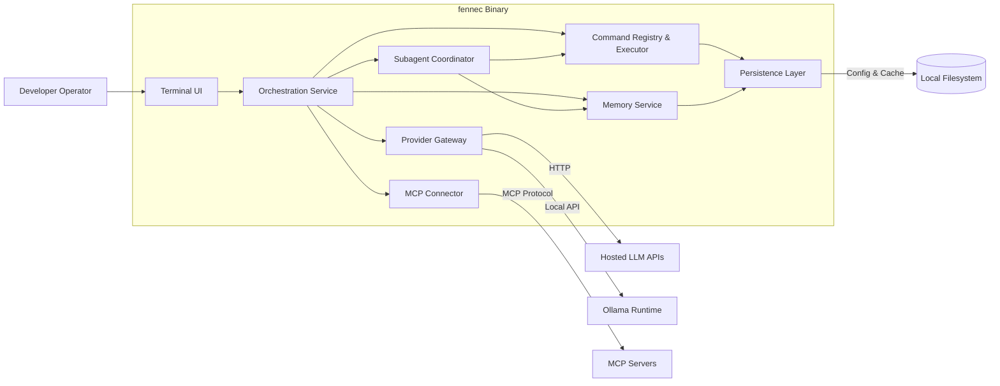

# Fennec C4 Level 2 — Container Diagram

## Purpose
Describe the major runtime containers/modules that compose Fennec and how they collaborate to deliver AI-assisted workflows.

## Container Overview
- **Terminal UI (TUI) Container**: `ratatui`-powered process responsible for rendering layouts, keybindings, command palette, and chat transcripts.
- **Orchestration Service**: Coordinates sessions, routes messages between chats, manages command execution, and interfaces with the memory service.
- **Subagent Coordinator**: Spawns role-specific helper agents, manages task delegation, and aggregates their outputs.
- **Memory Service**: Aggregates insights from `AGENTS.md`, `CLAUDE.md`, `.memory_bank`, and git history; exposes search/query endpoints.
- **Command Registry & Executor**: Hosts built-in commands (Claude Code equivalents), custom command loaders, and safety checks.
- **Provider Gateway**: Unified client for OpenAI, OpenRouter, Anthropic, and Ollama with streaming support.
- **MCP Connector**: Manages discovery and invocation of MCP servers (Codex, Claude Code) and mediates capability registration.
- **Persistence Layer**: Manages local config, session transcripts, cache files, and optional encrypted credential storage.

## Data Flows
1. Developer inputs via TUI → Orchestration → Command Registry or Provider Gateway.
2. Command execution may touch Memory Service, MCP Connector, and filesystem.
3. Provider responses stream back through Orchestration → Memory Service (for retention) → TUI render loop.

## Deployment Context
- Single binary (`fennec`) launched from terminal.
- Optional companion daemons: Ollama runtime, MCP servers.
- Configuration stored under platform-specific application data directories (e.g., `~/.config/fennec/`).

## Mermaid Diagram

## Command & Safeguard Considerations
- Core command catalog includes `plan`, `edit`, `diff`, `run`, `search`, `summarize`, and `scaffold`, each tagged with capability flags (filesystem, shell, network, provider).
- High-risk commands require plan + preview steps and explicit confirmation from the TUI before execution.
- Macro support reads from `config/commands.toml`, allowing scripted sequences with variable placeholders (see [Codex CLI Feature Inventory](./codex_featurelist.md) for approval and sandbox precedents).

## Security Considerations
- Secrets managed via env vars or keyring API; never persisted in plain text.
- File operations constrained by configured root directories and confirmation prompts.
- Command execution audited; logs sent through `tracing` with sensitive data redaction.
- Subagent Coordinator enforces recursion depth and per-role capability scopes.

## Open Questions
- Should the Provider Gateway run as a separate async task or inline within orchestration?
- How many concurrent subagents should we allow per session, and what resource limits apply?
- What caching strategy should the Memory Service employ for git history queries?
- Do we need a plugin loader for community MCP servers at this level?
- Where should the command macro files and plugin manifests be loaded from in multi-project setups?
