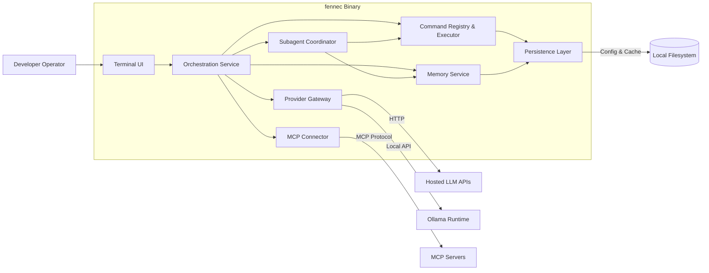

# Fennec C4 Level 2 — Container Diagram

## Purpose
Describe the major runtime containers/modules that compose Fennec and how they collaborate to deliver AI-assisted workflows.

## Container Overview

### Implemented Containers (✅ Production Ready)

- **Terminal UI (TUI) Container** (`fennec-tui`):
  - `ratatui` with `crossterm` for cross-platform terminal rendering
  - Multi-panel layout with chat, preview, and status panels
  - Event handling for keyboard input and TUI navigation
  - Real-time streaming response display with syntax highlighting

- **Orchestration Service** (`fennec-orchestration`):
  - `SessionManager` for single-chat coordination and state management
  - Provider request routing and response streaming
  - Command execution coordination with security validation
  - Session persistence and transcript management

- **Command Registry & Executor** (`fennec-commands`):
  - `CommandRegistry` with built-in commands: plan, edit, run, diff, summarize, enhanced-summarize
  - `CommandExecutor` with preview generation and safety checks
  - `FileOperations` for secure file read/write with diff generation
  - Capability-based command validation and execution

- **Memory Service** (`fennec-memory`):
  - AGENTS.md adapter for repository guidelines integration
  - Cline-style memory files (projectbrief.md, activeContext.md, progress.md)
  - Session transcript storage and retrieval
  - Git history awareness for contextual code understanding

- **Provider Gateway** (`fennec-provider`):
  - OpenAI Chat Completions API with streaming support
  - Configurable model selection and parameters
  - Rate limiting, retries, and error handling
  - Extensible provider trait for future integrations

- **Security & Audit System** (`fennec-security`):
  - Three-tier sandbox: ReadOnly, WorkspaceWrite, FullAccess
  - `ApprovalManager` with risk-based approval workflows
  - `AuditLogger` with JSON Lines format audit trails
  - Path traversal protection and command filtering

- **Persistence Layer** (`fennec-core`):
  - TOML configuration management with environment variable substitution
  - Platform-specific config directories (~/.config/fennec/)
  - Session data persistence and memory file management

### Future Containers (Roadmap)

- **Subagent Coordinator**: Role-specific helper agents (planner, reviewer, executor)
- **MCP Connector**: Model Context Protocol for external tool integration

## Data Flows

### Implemented Flow Patterns (✅ Production Ready)

1. **Command Execution Flow**:
   - Developer input via TUI → SessionManager → CommandRegistry → CommandExecutor
   - Security validation via SandboxPolicy → ApprovalManager (if required)
   - Command execution with audit logging → Results back to TUI

2. **LLM Provider Flow**:
   - User message → SessionManager → ProviderClient → OpenAI API
   - Streaming response → SessionManager → Memory persistence → TUI display
   - Session transcript updates with full conversation history

3. **Memory Integration Flow**:
   - Context retrieval: Memory Service → AGENTS.md + Git history + Session data
   - Context injection into LLM requests for relevant background
   - Session summaries → Memory files (progress.md, activeContext.md)

4. **File Operations Flow**:
   - Edit commands → FileOperations → Diff generation → User preview
   - Approval confirmation → Actual file write → Backup creation
   - Audit trail logging with command details and outcomes

### Security and Audit Flows

- **Capability Validation**: All commands checked against sandbox policies before execution
- **Approval Workflow**: High-risk operations require interactive user confirmation
- **Audit Logging**: Every privileged action logged with structured JSON format
- **Error Handling**: Comprehensive error propagation with user-friendly messages

## Deployment Context
- Single binary (`fennec`) launched from terminal.
- Optional companion daemons: Ollama runtime, MCP servers.
- Configuration stored under platform-specific application data directories (e.g., `~/.config/fennec/`).

## Mermaid Diagram

## Command & Safeguard Considerations
- Core command catalog includes `plan`, `edit`, `diff`, `run`, `search`, `summarize`, and `scaffold`, each tagged with capability flags (filesystem, shell, network, provider).
- High-risk commands require plan + preview steps and explicit confirmation from the TUI before execution.
- Macro support reads from `config/commands.toml`, allowing scripted sequences with variable placeholders (see [Codex CLI Feature Inventory](./codex_featurelist.md) for approval and sandbox precedents).

## Security Considerations
- Secrets managed via env vars or keyring API; never persisted in plain text.
- File operations constrained by configured root directories and confirmation prompts.
- Command execution audited; logs sent through `tracing` with sensitive data redaction.
- Subagent Coordinator enforces recursion depth and per-role capability scopes.

## Implementation Details

### Technical Architecture Decisions Made

1. **Provider Gateway**: Implemented inline within SessionManager using async Rust patterns
   - Streaming responses handled with tokio::sync channels
   - Provider abstraction allows future backend additions
   - Rate limiting and retry logic built into provider client

2. **Memory Service Caching**:
   - In-memory caching with LRU eviction for frequently accessed files
   - Git history queries cached per repository state
   - Session transcripts stored in structured format for fast retrieval

3. **Command Safety**:
   - All commands implement preview-first pattern
   - Capability flags declared at registration time
   - Sandbox policies enforced at execution boundaries

4. **Configuration Management**:
   - TOML configuration with environment variable substitution
   - Platform-specific directories following XDG Base Directory spec
   - Hierarchical config loading: CLI args → project config → user config → defaults

### Performance Characteristics

- **TUI Responsiveness**: 60fps rendering with efficient diff-based updates
- **Memory Usage**: Bounded session history with configurable limits
- **Streaming**: Real-time LLM response display with minimal buffering
- **File Operations**: Atomic writes with backup creation for safety

### Future Architectural Extensions

- **Plugin System**: Command registry extensible for custom commands
- **Multi-Provider**: Provider trait ready for Anthropic, Ollama, OpenRouter
- **Subagent Coordination**: Event-driven architecture for helper agents
- **MCP Integration**: Protocol adapter pattern for external tool servers
