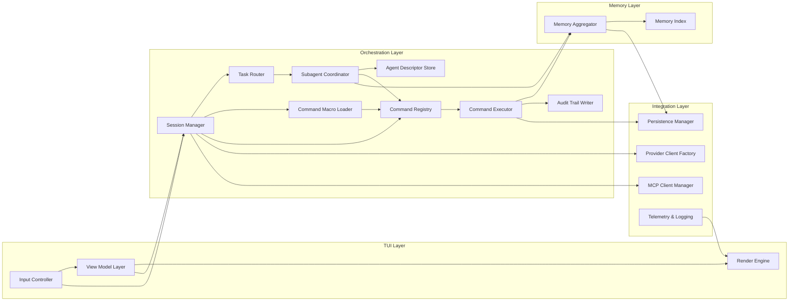

# Fennec C4 Level 3 — Component Diagram (Core CLI)

## Purpose
Detail the internal components within the CLI container, emphasising how the TUI, orchestration, memory, and command systems interact.

## Component Catalog

### Implemented Components (✅ Production Ready)

#### TUI Layer (`fennec-tui`)
- **App Controller**: Main TUI application with event loop, state management, and security integration
- **Event Handler**: Keyboard input processing (`crossterm`), command dispatch, and navigation
- **Layout Manager**: Multi-panel layout with chat, preview, and status panels using `ratatui`
- **Render Engine**: Widget rendering with syntax highlighting and streaming response display
- **Theme System**: Configurable UI styling and color schemes

#### Orchestration Layer (`fennec-orchestration`)
- **Session Manager**: Single-chat coordination, conversation state, and provider integration
- **Transcript Manager**: Session history persistence with structured storage
- **Context Injector**: Memory integration for LLM request context enhancement
- **Response Streamer**: Real-time streaming response handling and display coordination

#### Command System (`fennec-commands`)
- **Command Registry**: Built-in command catalog with `CommandDescriptor` metadata
  - Commands: `plan`, `edit`, `run`, `diff`, `summarize`, `enhanced-summarize`
  - Capability declarations: `ReadFile`, `WriteFile`, `ExecuteShell`, `NetworkAccess`
- **Command Executor**: Execution engine with preview generation and security validation
- **File Operations**: Secure file I/O with `similar` crate for diff generation
- **Command Context**: Execution context with sandbox level and cancellation support

#### Memory System (`fennec-memory`)
- **Memory Service**: Unified memory management with async operation support
- **AGENTS.md Adapter**: Repository guidelines integration with Markdown parsing
- **Cline Memory Adapter**: Compatible with existing `.memory_bank` file formats
- **Git History Adapter**: Repository analysis using `git2` crate for context
- **Session Store**: Conversation transcript storage with JSON serialization

#### Security System (`fennec-security`)
- **Sandbox Policy Engine**: Three-tier model (`ReadOnly`, `WorkspaceWrite`, `FullAccess`)
- **Approval Manager**: Risk-based workflows with `RiskLevel` classification
- **Audit System**: Comprehensive logging with `AuditEvent` structures
  - Event types: Command execution, file operations, security violations
  - JSON Lines format with structured metadata
- **Path Validator**: Traversal protection and workspace boundary enforcement

#### Provider System (`fennec-provider`)
- **OpenAI Client**: Chat Completions API with streaming via `reqwest`
- **Provider Trait**: Extensible abstraction for future LLM backends
- **Rate Limiter**: Request throttling and exponential backoff retry logic
- **Response Handler**: Streaming response processing with error recovery

#### Core Infrastructure (`fennec-core`)
- **Configuration System**: TOML loading with environment variable substitution
- **Error Types**: Structured error handling with `thiserror` and `anyhow`
- **Domain Types**: Shared types for sessions, commands, and providers
- **Utility Functions**: Common functionality across crates

### Future Components (Roadmap)

#### Advanced Orchestration
- **Subagent Coordinator**: Multi-agent task delegation and coordination
- **Task Router**: Agent selection and conflict resolution
- **Agent Descriptor Store**: Role definitions and capability management

#### External Integration
- **MCP Client Manager**: Model Context Protocol for external tool integration
- **Plugin System**: Dynamic command loading and extension support
- **Macro Expander**: Command sequence automation and scripting

## Interactions
1. Input Controller → Session Manager → Command Registry to resolve an action.
2. Session Manager → Task Router to determine delegation (primary agent vs. helper subagents).
3. Command Macro Loader expands recipe commands before execution, returning step-by-step plans.
4. Command Executor → Memory Aggregator for contextual retrieval before contacting providers.
5. Session Manager → Provider Client Factory → Provider Gateway for streaming responses.
6. Subagent Coordinator requests context and command handles, returning synthesized responses to Session Manager.
7. MCP Client Manager invoked by commands needing external tool capabilities.
8. Memory Aggregator updates Memory Index when git state or docs change and notifies interested components.

## Mermaid Diagram

## Key Decisions
- Memory adapters operate asynchronously with caching to avoid blocking the render loop.
- Command handlers return structured results (success, preview, confirmation required) to keep the TUI responsive.
- Macro expansion runs before capability checks so previews reflect the entire sequence.
- Session Manager exposes trait-based hooks so multi-chat orchestration and subagent lifecycles extend single-chat behaviour.
- Audit Trail Writer records privileged actions in append-only logs stored under the project workspace.

## Detailed Notes
- **Command Descriptor Schema**: `{ id, label, summary, default_key, capabilities[], requires_confirmation, preview_mode, handler }`.
- **Macro Definition**: Stored in TOML as `{ name, description, steps[], variables[], guard_conditions[] }` (aligns with automation patterns in [Codex CLI](./codex_featurelist.md)).
- **Subagent Roles**: Planner (produces plan), Executor (runs commands with filesystem/shell access), Reviewer (validates diffs, requires only read access), Researcher (search/web tools, optional network) — inspired by workflows cataloged in [Claude Code Feature Inventory](./claude_code_featurelist.md).
- **Memory Entry Schema**: `{ source, role, scope, tags[], created_at, content, relevance_score, hash }` stored in local index; expose lexical and semantic search endpoints (reference [Cline Memory Bank Notes](./cline_memory_bank.md)).
- **Audit Log Format**: JSON lines with `{ timestamp, actor, command, capabilities_used[], outcome, confirmation }` rotated per session.

## Implementation Details

### Technical Implementation Notes

#### Command Execution Flow (Implemented)
1. **Input Processing**: Event handler captures user input and parses commands
2. **Security Validation**: Sandbox policy checks command capabilities against current level
3. **Preview Generation**: Commands generate structured previews before execution
4. **Approval Workflow**: High-risk operations trigger interactive confirmation dialogs
5. **Execution**: Commands execute with audit logging and error handling
6. **Result Display**: Outcomes displayed in TUI with syntax highlighting

#### Memory System Architecture (Implemented)
- **Hierarchical Context**: AGENTS.md (global) → Project AGENTS.md → Session context
- **Caching Strategy**: LRU cache for frequently accessed files and Git queries
- **Search Implementation**: Fuzzy matching with `fuzzy-matcher` crate for context retrieval
- **Memory Persistence**: JSON serialization for session data, Markdown for human-readable files

#### Security Architecture (Implemented)
- **Capability System**: Commands declare required capabilities at registration
- **Risk Assessment**: Automatic classification of commands and file operations
- **Audit Trail**: Complete command history with approval status and outcomes
- **Path Security**: Canonical path resolution with traversal attack prevention

### Performance Optimizations

- **Async Design**: All I/O operations use async Rust patterns for responsiveness
- **Streaming UI**: Real-time response display with minimal buffering
- **Memory Management**: Bounded session history with configurable retention
- **Diff Generation**: Efficient line-by-line comparison with `similar` crate

### Architectural Decisions Resolved

1. **Memory Ranking**: Combination of recency (timestamp) and relevance (fuzzy match score)
2. **Command Cancellation**: Implemented via `tokio::sync::CancellationToken`
3. **Telemetry**: Configurable `tracing` levels with optional file output
4. **Audit Security**: JSON Lines format with sensitive data redaction
5. **Provider Integration**: Trait-based design allows multiple LLM backends
6. **Configuration**: Hierarchical TOML with environment variable substitution

### Future Architecture Considerations

- **Plugin Security**: Sandbox policies for community-developed commands
- **Multi-Provider**: Load balancing and fallback strategies for LLM providers
- **Distributed Memory**: Shared memory across team members and sessions
- **Performance Monitoring**: Built-in profiling and performance metrics
