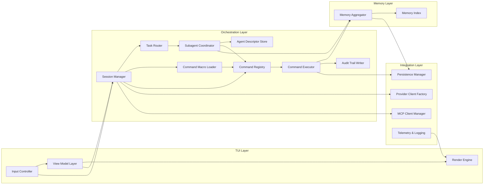

# Fennec C4 Level 3 — Component Diagram (Core CLI)

## Purpose
Detail the internal components within the CLI container, emphasising how the TUI, orchestration, memory, and command systems interact.

## Component Catalog
- **Input Controller**: Normalises keybindings, command palette selection, and chat navigation events.
- **View Model Layer**: Maintains reactive state for panes (single chat, multi-chat workspace, status bars) and exposes render-ready structs.
- **Render Engine**: Encapsulates `ratatui` widgets, layout managers, and diffed screen updates.
- **Session Manager**: Owns active conversations, multi-chat orchestration, and lifecycle hooks for agents.
- **Subagent Coordinator**: Spawns helper agents, tracks task assignments, and aggregates their responses.
- **Agent Descriptor Store**: Maintains role definitions, capability flags, memory scopes, and recursion limits for each subagent.
- **Task Router**: Chooses when to delegate to subagents vs. primary agent, sequences outputs, and resolves conflicts.
- **Command Registry**: Stores metadata and handlers for default commands (plan, edit, diff, run, search, summarize, scaffold) and user-defined extensions.
- **Command Executor**: Performs pre-flight checks (sandbox policies, capability requirements), executes commands, and logs outcomes including diff previews.
- **Command Macro Loader**: Reads macros/recipes from `config/commands.toml` and expands them into executable plans.
- **Memory Aggregator**: Pulls entries from adapters (`CodexDocAdapter`, `ClaudeDocAdapter`, `MemoryBankAdapter`, `GitHistoryAdapter`) and indexes them.
- **Memory Index**: Provides semantic + lexical search over aggregated entries and exposes context retrieval API.
- **Provider Client Factory**: Produces streaming clients for each LLM provider, handling auth, retries, and rate limits.
- **MCP Client Manager**: Negotiates MCP sessions, capability discovery, and invocation with backpressure controls.
- **Persistence Manager**: Reads/writes configs, session snapshots, and caches via `serde` formats (JSON/TOML).
- **Telemetry & Logging**: Centralised `tracing` subscriber with sinks for file logs and optional console overlays.
- **Audit Trail Writer**: Persists privileged command actions and confirmations for later review.

## Interactions
1. Input Controller → Session Manager → Command Registry to resolve an action.
2. Session Manager → Task Router to determine delegation (primary agent vs. helper subagents).
3. Command Macro Loader expands recipe commands before execution, returning step-by-step plans.
4. Command Executor → Memory Aggregator for contextual retrieval before contacting providers.
5. Session Manager → Provider Client Factory → Provider Gateway for streaming responses.
6. Subagent Coordinator requests context and command handles, returning synthesized responses to Session Manager.
7. MCP Client Manager invoked by commands needing external tool capabilities.
8. Memory Aggregator updates Memory Index when git state or docs change and notifies interested components.

## Mermaid Diagram

## Key Decisions
- Memory adapters operate asynchronously with caching to avoid blocking the render loop.
- Command handlers return structured results (success, preview, confirmation required) to keep the TUI responsive.
- Macro expansion runs before capability checks so previews reflect the entire sequence.
- Session Manager exposes trait-based hooks so multi-chat orchestration and subagent lifecycles extend single-chat behaviour.
- Audit Trail Writer records privileged actions in append-only logs stored under the project workspace.

## Detailed Notes
- **Command Descriptor Schema**: `{ id, label, summary, default_key, capabilities[], requires_confirmation, preview_mode, handler }`.
- **Macro Definition**: Stored in TOML as `{ name, description, steps[], variables[], guard_conditions[] }` (aligns with automation patterns in [Codex CLI](./codex_featurelist.md)).
- **Subagent Roles**: Planner (produces plan), Executor (runs commands with filesystem/shell access), Reviewer (validates diffs, requires only read access), Researcher (search/web tools, optional network) — inspired by workflows cataloged in [Claude Code Feature Inventory](./claude_code_featurelist.md).
- **Memory Entry Schema**: `{ source, role, scope, tags[], created_at, content, relevance_score, hash }` stored in local index; expose lexical and semantic search endpoints (reference [Cline Memory Bank Notes](./cline_memory_bank.md)).
- **Audit Log Format**: JSON lines with `{ timestamp, actor, command, capabilities_used[], outcome, confirmation }` rotated per session.

## Open Questions
- How will we prioritise or rank memory retrieval results (recency vs. relevance weighting)?
- Should command execution be cancellable mid-flight from the UI?
- How do we prevent subagent loops or conflicting outputs while keeping UX fluid?
- What scoring mechanism should Task Router use when reconciling subagent recommendations?
- How should macro execution failures be surfaced to the user (stop vs continue)?
- What is the minimal telemetry footprint acceptable for privacy-conscious users?
- Do we need encryption at rest for audit logs and memory caches?
