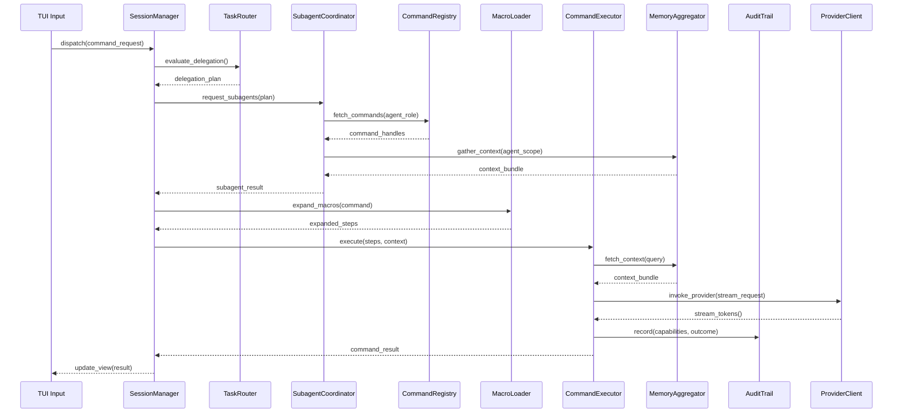

# Fennec C4 Level 4 — Code-Level Design Notes

## Purpose
Capture implementation-level details for critical modules to guide contributors and keep architecture decisions traceable.

## Reference Material
- [Claude Code Feature Inventory](./claude_code_featurelist.md) for plan/explain/diff workflows.
- [Codex CLI Feature Inventory](./codex_featurelist.md) for sandbox, approvals, and automation patterns.
- [Cline Memory Bank Notes](./cline_memory_bank.md) for guidance on persistent memory handling.

## Target Modules
1. **`src/orchestration/session_manager.rs`**
   - Public API surface (traits, structs, async functions)
   - State machine for single vs. multi-chat modes
   - Hooks for command completion and provider streaming events
2. **`src/orchestration/task_router.rs`**
   - Delegation heuristics for when to involve subagents
   - Scoring functions to reconcile helper outputs and resolve conflicts
   - Recursion depth enforcement and timeout management
3. **`src/memory/mod.rs`**
   - Adapters: `codex_doc.rs`, `claude_doc.rs`, `memory_bank.rs`, `git_history.rs`
   - Unified `MemoryEntry` schema and indexing strategy
   - Cache invalidation strategy (file watchers, git event listeners)
   - Pluggable backends (`InMemory`, `sled`, optional `sqlite` via `sqlx` feature)
4. **`src/orchestration/subagents.rs`**
   - `SubagentCoordinator` implementation and task queue management
   - Lifecycle handling for helper agents (spawn, delegate, reconcile, retire)
   - Metrics and safeguards to avoid runaway recursion or duplication
5. **`src/agents/descriptor.rs`**
   - Definition of `AgentDescriptor`, capability flags, and memory scope policies
   - Serialization for config-driven subagents
   - Validation helpers for custom roles and macro-defined agents
6. **`src/commands/mod.rs`**
   - Command registration macros/helpers
   - Default command implementations (plan, edit, diff, run, search, summarize, scaffold)
   - Custom command loading from `config/commands.toml`
7. **`src/commands/macros.rs`**
   - Macro parsing, variable interpolation, and guard evaluation
   - Plan + preview generation for multi-step recipes
8. **`src/security/audit.rs`**
   - Append-only log writer with rotation and optional encryption
   - Capability usage tracking per command
9. **`src/provider/gateway.rs`**
   - Trait definitions for LLM clients with streaming callbacks
   - Provider-specific implementations (OpenAI, OpenRouter, Anthropic, Ollama)
   - Retry/backoff and error handling policies
10. **`src/tui/`**
   - Layout definitions (`layout.rs`, `widgets/`)
   - Input handling and keymap configuration
   - Rendering loop integration with async event queues

## Coding Standards Reference
- Use `thiserror` for error enums and `anyhow::Result` only at top-level boundaries.
- Prefer dependency injection via traits for testability (e.g., `MemoryProvider`, `CommandRunner`).
- Keep modules under 500 lines; split into submodules when exceeding responsibility scope.
- Annotate command handlers and subagent operations with `tracing` spans for observability.
- Avoid `unwrap()`; surface contextual errors via `Context` and map them to user-friendly messages in the TUI.

## Testing Expectations
- Unit tests colocated with modules (`#[cfg(test)]`).
- Integration tests under `tests/` for session flows, memory aggregation, and command execution pipelines.
- Snapshot tests for TUI rendering via virtual terminal harnesses.
- Behavioural tests simulating planner → executor → reviewer workflows with mocked providers.
- Property tests for macro expansion to ensure guard conditions and variable interpolation behave correctly.
- Smoke script verifying default commands, memory indexing, and audit logging (`scripts/smoke.sh`).

## Mermaid Diagram

## Open Items
- Define mocking strategy for provider clients (trait objects vs. feature-gated fake implementations).
- Decide on storage format for cached memory index (in-memory vs. sled/sqlite) and whether to expose a plugin interface for third-party stores.
- Evaluate need for a background worker runtime for long-running commands.
- Define safeguards against subagent recursion and conflicting state updates.
- Determine encryption requirements for audit logs and memory caches (optional libsodium integration?).
- Specify configuration precedence between global `fennec.toml`, project `.fennec/fennec.toml`, and command macro files.
